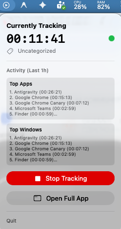
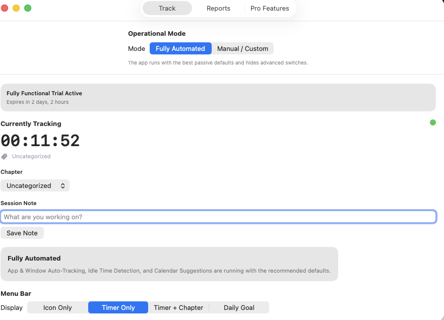
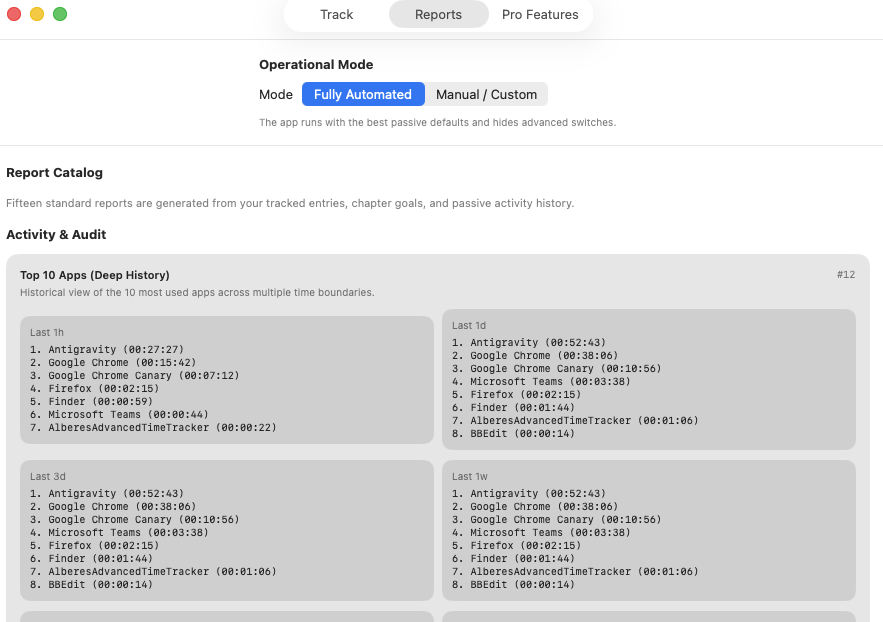
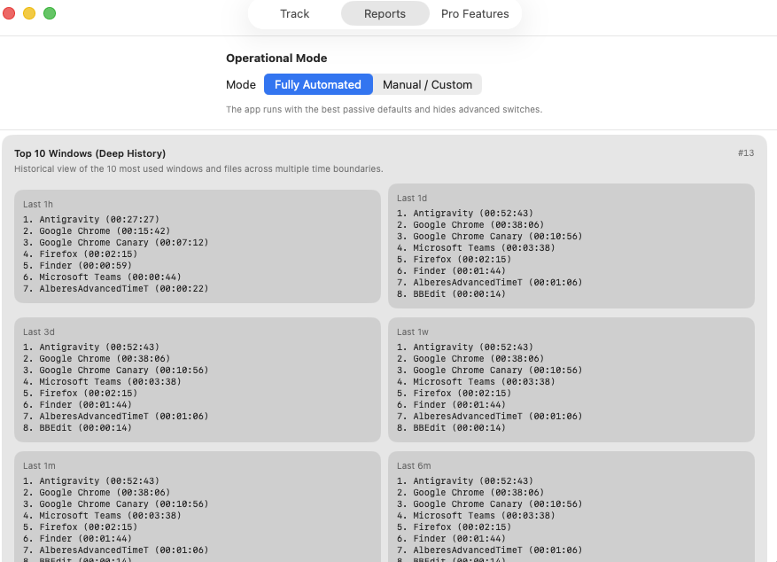
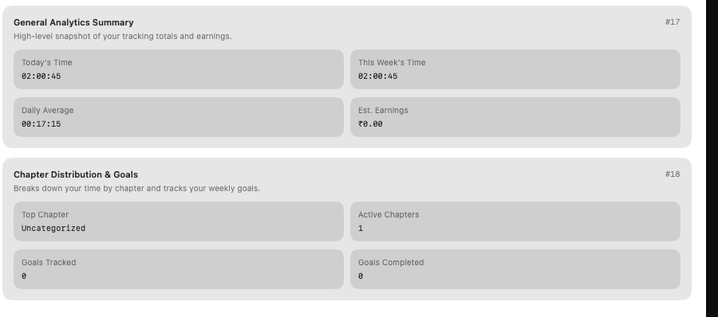
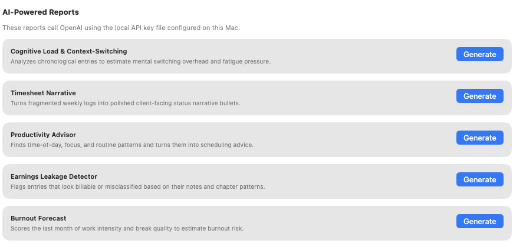
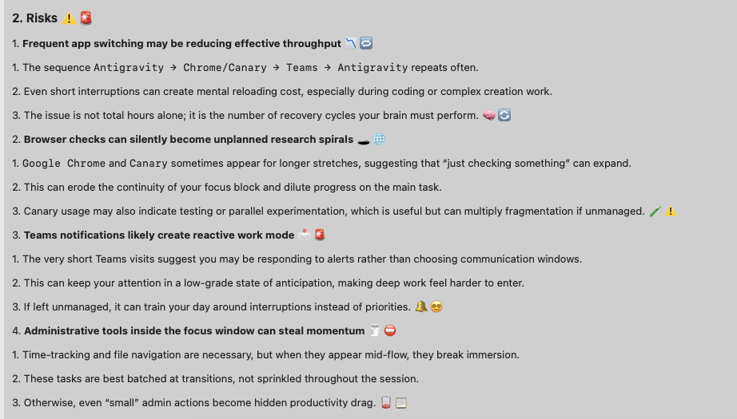
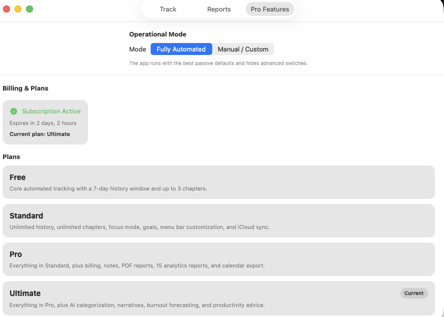

# Alberes Advanced Time Tracker

**Track your life in seconds, not rounded guesses.**

 
**[📥 Download Alberes Advanced Time Tracker v1.1 (DMG)](/apps/macos/alberes/release/AlberesAdvancedTimeTracker-1.1.dmg)**

  
  &nbsp;
  
  &nbsp;
  
  &nbsp;
  

  
  &nbsp;
  
  &nbsp;
  
  &nbsp;
  

Alberes Advanced Time Tracker is a native macOS menu bar app for people who want precise, local-first time data, flexible Chapters, and analytics that actually reveal how their days are spent. 

Most trackers force your day into arbitrary blocks. Alberes records down to the second so your logs reflect what actually happened. 

[View Documentation](./documentation.md)

---

## 🚀 Key Benefits

*   **Precision That Respects Reality:** 1-second interval logging for absolute precision. 
*   **Built For Deep Work Systems:** Organize sessions into custom Chapters like Deep Work, Admin, Lesson, or Recovery, then see where your attention really went.
*   **Local-First By Default:** Your raw time entries live on your Mac. Export to CSV or JSON whenever you want to analyze your history in your own tools.
*   **Lightweight Enough To Stay Open:** Alberes lives in the menu bar with instant controls, keyboard shortcuts, and low-friction switching between Chapters.

## ✨ Core Features

### Ultra-Granular Tracking
Log life events down to the second. Add notes and descriptions to your live sessions and historical entries.

### Chapter Categorization
Group entries into distinct life "Chapters". Assign billable rates to chapters and see estimated earnings in your analytics and history.

### Focus Mode
Run Pomodoro-style countdown sessions with optional break blocks to enhance your productivity.

### Weekly Goals & Time Budgets
Set minimum or maximum weekly hour targets per chapter and monitor your progress with visual indicators.

### Menu Bar Customization
Keep your workspace clean. Choose between an icon-only, timer-only, or timer-plus-chapter display in the macOS menu bar.

### Granular Analytics & Background Reporting
View detailed statistics, timelines, and productivity patterns. Receive automated HTML reports delivered via email.

---

## 🔒 Your Data, Your Control

*   **No Cloud Lock-In:** Alberes is local-first and stores your entries on-device.
*   **Export Everything:** Own your time data. Export your history to CSV or JSON.
*   **Manual Adjustments:** Edit, split, or merge time blocks retroactively with 1-second precision.
*   **Idle Detection:** Get prompted to assign idle time to a Chapter or discard it.

## 💻 Requirements

*   macOS 14 or newer

---

[Check out the User Guide for detailed instructions](./documentation.md)
