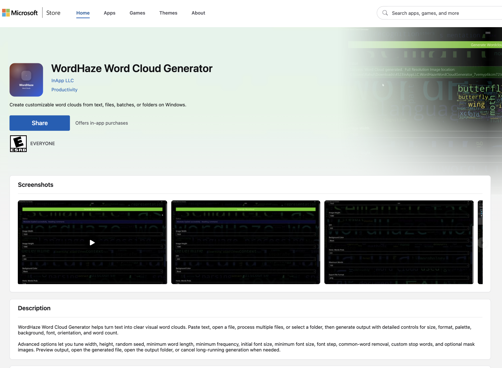
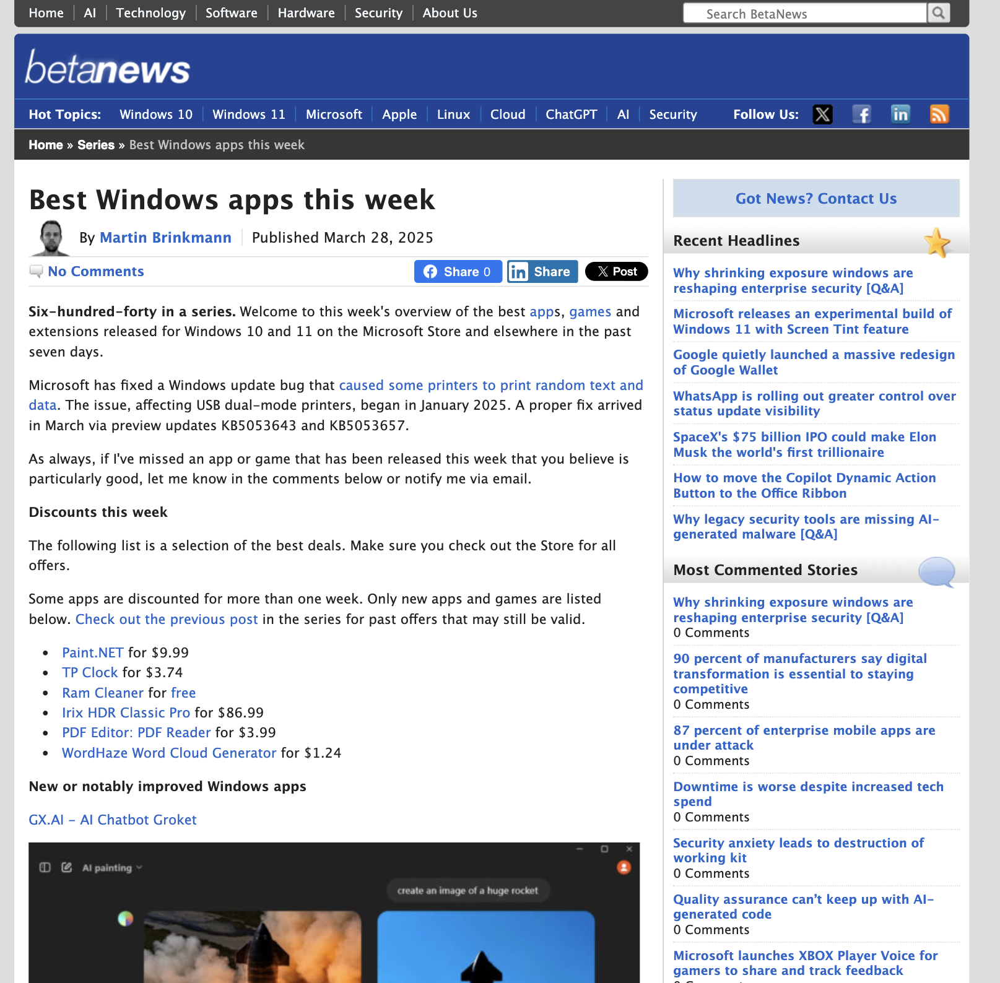
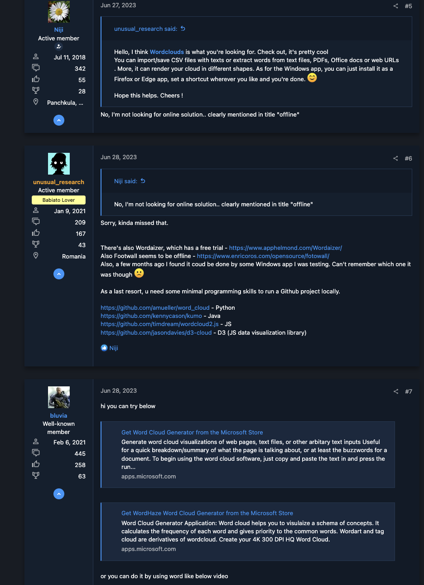

# TutivSoft

**TutivSoft makes small software products for practical work.**
WordHaze is a Microsoft Store word-cloud app published on December 24, 2020.

---

## Quick Links
- [View Products On Website](https://tutivsoft.com/shop/)
- [Explore WordHaze](#wordhaze)

---

## Product Areas
### Small software products with checkout and license delivery

*   **Browser Productivity**: Extensions and tools for daily work.
*   **Text and AI Utilities**: Tools for text, knowledge work, and productivity.
*   **Billing and Licensing**: WooCommerce checkout, license delivery, and account access.

---

## WordHaze
### WordHaze creates word-cloud summaries from longer text

WordHaze is a Windows app listed on the Microsoft Store. It helps review longer text by showing the words that appear most often.

*   **Published:** December 24, 2020
*   **Key Features:**
    *   Create word-cloud images from text.
    *   Review frequent words in longer text.
    *   Use it as an offline Windows app.

---

## Recognition

### Microsoft Store
*   **Label:** Microsoft Store
*   **Details:** Windows app listing for WordHaze Word Cloud Generator.
*   

### BetaNews
*   **Label:** BetaNews
*   **Details:** WordHaze was included in a Windows app roundup.
*   

### Software Discussion
*   **Label:** Community mention
*   **Details:** WordHaze appears in a discussion about offline Windows word-cloud software.
*   

---

## Platform Support
### WordHaze runs on Windows
WordHaze is an offline Windows app for creating word-cloud images from text.

---

© 2021-2026 TutivSoft. All Rights Reserved.
